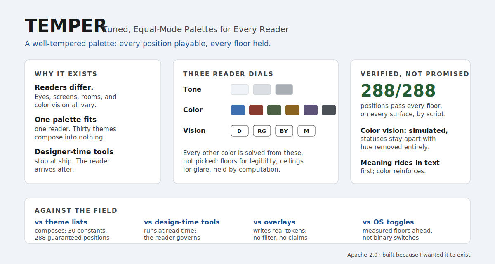

# TEMPER

A production-ready semantic color system with five appearance modes on one shared token schema. It targets dense text, dashboards, documentation, and standards-oriented sites: readability first, clear surface delineation, low visual noise. No build step is required to use it; the whole system is one CSS file, one JSON export, and a small switcher. On npm it is published as `temper-color`.

<picture>
  <source media="(prefers-color-scheme: dark)" srcset="assets/temper-overview-dark.svg">
  
</picture>

TEMPER stands for Tuned, Equal-Mode Palettes for Every Reader, and the name is meant literally in three senses. To temper is to hold something between extremes, which is the floors-and-ceilings principle at the heart of the solver: every color is kept above a legibility floor and below a glare cap. A temperament, in tuning, is the set of small compromises that makes every key playable on one instrument, which is what the solver does across every mode, notch, family, and vision position, so no combination is left unusable. And color temperature is the warm-to-cool axis the color families carry. A well-tempered palette, in short.

The five modes are System, Light, Soft Light, Soft Dark, and Dark. They form a single luminance ladder rather than five unrelated skins, and every component reads semantic roles (surface, border, text, accent) instead of raw colors, so one attribute change restyles the page.

## Contents

- `theme.css`: CSS custom properties for all five modes. The static, no-JS baseline.
- `tokens.json`: the design tokens in a documented JSON shape (one schema, four value sets, plus the System resolution rule).
- `derive.js`: the parametric deriver (Version 2). Solves a full palette in OKLCH from three primitives. Zero dependencies, ES module.
- `tuner.js`: an optional vanilla-JS widget that tunes the deriver live and writes the result to the document root. ES module.
- `tuner.bundle.js`: a generated classic-script build of the two modules, used only so `demo.html` runs from a local file.
- `demo.html`: a self-contained preview with both the static switcher and the live tuner.
- `BRANDING.md`: how a brand adopts the system without losing its identity.
- `scripts/build-theme-css.mjs`: regenerates `theme.css` from the deriver (middle notch, Iron family), so the static baseline and the parametric layer share one source.
- `scripts/contrast.mjs`: the WCAG contrast checker for the static baseline, read from the deriver.
- `scripts/build-tokens.mjs`: regenerates `tokens.json` from the deriver output.
- `scripts/verify-derive.mjs`: derives all 288 positions, asserts every floor on every surface, checks color-vision distinguishability, and reports the APCA readout and brand fidelity.
- `scripts/apca.mjs`: an APCA Lc implementation used by the verifier for a perceptual readout (dev-time only, not shipped in the runtime).
- `scripts/build-demo-bundle.mjs`: regenerates `tuner.bundle.js` from the modules.

## Quickstart: Three Paths In

The fastest path is one file and no JavaScript; the fullest is the live tuner. Pick by how much you want.

### Path 1: Static Modes Only (any site, any host, 30 seconds)

Copy `theme.css` into your project and set a mode on the root element. There is no build step and nothing Vercel-specific; this works on any host, including plain static hosting.

```html
<link rel="stylesheet" href="/theme.css">
<html data-theme="system">
```

Style everything with the semantic custom properties (`var(--color-bg-base)`, `var(--color-text-primary)`, `var(--color-accent)`, and the rest of the schema in section 2). A three-button mode switcher is just `document.documentElement.dataset.theme = "soft-dark"` plus localStorage.

### Path 2: Next.js on Vercel (App Router, five minutes)

Copy `theme.css` and `tuner.js` into your app (for example `app/theme.css` and `lib/temper/tuner.js`), then:

```tsx
// app/layout.tsx
import "./theme.css";

const themeInit = `try{var s=JSON.parse(localStorage.getItem("temper")||"{}");
document.documentElement.dataset.theme=s.mode||"system";}catch(e){
document.documentElement.dataset.theme="system";}`;

export default function RootLayout({ children }: { children: React.ReactNode }) {
  return (
    <html lang="en" suppressHydrationWarning>
      <head>
        <script dangerouslySetInnerHTML={{ __html: themeInit }} />
      </head>
      <body>{children}</body>
    </html>
  );
}
```

The inline script applies the stored mode before first paint, so there is no flash of the wrong theme; server-rendered HTML arrives neutral and the attribute lands before styles resolve. Then mount the tuner from any client component:

```tsx
// components/temper-tuner.tsx
"use client";
import { useEffect } from "react";

export function TemperTuner() {
  useEffect(() => {
    let dispose: (() => void) | undefined;
    import("@/lib/temper/tuner.js").then(({ initTuner }) => {
      const t = initTuner();
      dispose = t && t.destroy;
    });
    return () => dispose && dispose();
  }, []);
  return null;
}
```

`initTuner()` renders the panel, persists choices, follows the OS for System, honors `prefers-contrast: more` by raising the solver floors, and applies derived palettes as CSS custom properties. A branded site passes options: `initTuner({ brand: { family: "iron", notches: [0, 1] } })` fixes or curates the color family and tone range; vision settings are never restrictable by design.

### Path 3: Tailwind (v4)

Map the semantic tokens once in your CSS entry and use them as utilities everywhere:

```css
@import "tailwindcss";
@import "./theme.css";

@theme inline {
  --color-base: var(--color-bg-base);
  --color-surface: var(--color-surface);
  --color-ink: var(--color-text-primary);
  --color-ink-soft: var(--color-text-secondary);
  --color-line: var(--color-border);
  --color-accent: var(--color-accent);
}
```

Then `bg-base`, `text-ink`, `border-line`, `bg-surface`, `text-accent` respond to every mode and to the tuner automatically. If your bundler does not inline the second `@import`, paste the palette blocks from `theme.css` directly; they are generated, so regenerating them is one command (`node scripts/build-theme-css.mjs`).

An npm package (`temper-color`) and framework adapter packages (a Next.js provider with a cookie mirror for fully server-rendered theming, a web component, Vue and Svelte wrappers) are planned; until then, vendoring the two files is the supported path and is how the first production adopter runs it.

## 1. Theme Philosophy

Most sites ship two themes, light and dark, and treat them as opposites. That leaves two common complaints unaddressed. A crisp daylight light mode is often too high-contrast for long reading, and a single dark mode is often either too shallow for a bright room or too deep for a dim one. This system answers both by placing four explicit palettes on one luminance ladder and adding System as a fifth mode that maps to the OS preference.

The ladder runs from bright to dark:

- **Light** is a crisp daylight UI. Backgrounds are slightly off-white rather than stark white, and contrast is high. Use it for bright environments, marketing pages, and anything that benefits from maximum legibility at a glance.
- **Soft Light** is a gentler, reading-oriented light mode. The background is a warm neutral, contrast is softened, and the whole surface is calmer. Use it for long-form documentation and writing-heavy pages where the crispness of Light becomes fatiguing.
- **Soft Dark** is the most comfortable everyday dark working environment. It is a dark gray, not black, so surfaces separate cleanly and text sits comfortably for hours. Use it for apps, dashboards, and editors where a person works for hours.
- **Dark** is a deeper low-light mode. It drops the base further for dim rooms and OLED comfort while keeping borders and text legible. Use it at night or when the surroundings are dark.
- **System** follows the operating system. In a light-preference OS it resolves to Light; in a dark-preference OS it resolves to Dark. This is the least surprising default: an OS set to Dark Mode gets the deep Dark palette. If you would rather System-dark resolve to the gentler Soft Dark, that is a one-line configuration change, documented under "Configuring System" below.

Five modes are justified because each earns a distinct job: two light modes separate glance-legibility from reading comfort, two dark modes separate the everyday working depth from the low-light depth, and System removes the need for the visitor to choose at all. The tradeoff is more values to maintain, which this system absorbs by generating the exports from a single source object and verifying contrast mechanically rather than by eye.

### Accent Family

The accent is a restrained iron-blue held at a consistent hue (near 212 to 216 degrees) across all five modes, with chroma kept low so it reads as a calm, professional signal rather than a saturated call to attention. Blue was chosen over an oxide-red alternative because it carries interactive meaning (links, focus, primary action) without the alarm connotation red brings, and because a desaturated blue coexists quietly with neutral grays in both light and dark. In the light modes the accent is a darker blue so it clears AA as link text on a pale background; in the dark modes it lifts to a lighter blue for the same reason against a dark background. A separate `accent/solid` token gives primary buttons a fill that pairs with white text at AA in every mode, which a single link-colored accent cannot do on its own.

Neutrals are near-gray with a slight temperature shift per family: the Light and dark modes lean very slightly cool, while Soft Light leans warm to soften the reading surface without tipping into a nostalgic paper look.

## 2. Token Model

There is one schema. Every token below exists in all four explicit palettes; System is not a value set but a runtime resolution to Light or Dark. Tokens are grouped by role.

Backgrounds and surfaces:

- `background/base`: the page background behind everything.
- `background/subtle`: a recessed background for wells and sidebars, one step below base.
- `surface/default`: raised surface for cards, panels, and menus.
- `surface/hover`: surface under a hovered interactive element.
- `surface/active`: surface under a pressed or selected element.

Borders:

- `border/default`: standard hairline separator and control border.
- `border/strong`: higher-contrast border for emphasis and dividers.

Text:

- `text/primary`: body and heading text.
- `text/secondary`: supporting text and labels.
- `text/tertiary`: muted metadata and placeholders.
- `text/on-accent`: foreground on a solid accent fill.

Accent:

- `accent/default`: interactive accent for links, icons, and active state.
- `accent/hover`: accent under hover.
- `accent/subtle`: tinted accent background for selected rows and quiet emphasis.
- `accent/solid`: fill for primary buttons, paired with `text/on-accent`.

Status:

- `success/default`, `success/subtle`
- `warning/default`, `warning/subtle`
- `danger/default`, `danger/subtle`

Utility:

- `focus/ring`: keyboard focus ring.
- `selection/background`: text selection highlight.
- `code/background`, `code/text`: inline and block code.
- `table/stripe`: zebra background for alternate rows.
- `overlay`: scrim behind modals and drawers.

In CSS the token path becomes a custom property: slashes join with a dash and `background` abbreviates to `bg`. So `background/base` is `--color-bg-base`, `surface/hover` is `--color-surface-hover`, and `accent/subtle` is `--color-accent-subtle`. Non-color tokens (`--font-sans`, `--font-mono`, `--radius-sm|md|lg`, `--ring-width`, `--shadow-sm|md`) live in the same file and, except for the shadows, do not change per mode.

## 3. The Five Palettes

These values are generated from the deriver at the middle notch, Iron family, default vision, the same source as `theme.css` and `tokens.json`, which are the source of truth; the tables below are for reference. System is omitted because it resolves to Light or Dark.

### Backgrounds, Surfaces, Borders

| Token | Light | Soft Light | Soft Dark | Dark |
| --- | --- | --- | --- | --- |
| background/base | `#F0F4F9` | `#DBDEE3` | `#24272A` | `#14161A` |
| background/subtle | `#E7EAF0` | `#D1D5DA` | `#1D2024` | `#0E1013` |
| surface/default | `#FFFFFF` | `#FFFFFF` | `#323539` | `#25282C` |
| surface/hover | `#F2F5FB` | `#F2F5FB` | `#383B3F` | `#2B2E32` |
| surface/active | `#E7EBF0` | `#E7EBF0` | `#3E4145` | `#323539` |
| border/default | `#C9CDD1` | `#B6BABF` | `#3D4044` | `#313438` |
| border/strong | `#A7AAAF` | `#969A9F` | `#55585C` | `#494C50` |

### Text and Accent

| Token | Light | Soft Light | Soft Dark | Dark |
| --- | --- | --- | --- | --- |
| text/primary | `#17181A` | `#060708` | `#F9FAFD` | `#EFF1F4` |
| text/secondary | `#3F4143` | `#37383B` | `#BFC1C4` | `#B8BABD` |
| text/tertiary | `#56595C` | `#4E5053` | `#9EA1A4` | `#979A9D` |
| text/on-accent | `#FFFFFF` | `#FFFFFF` | `#FFFFFF` | `#FFFFFF` |
| accent/default | `#1E4E8C` | `#0F417E` | `#86BAFF` | `#76A9EE` |
| accent/hover | `#0A3E7A` | `#003068` | `#AFD1FF` | `#90C0FF` |
| accent/subtle | `#C9E0FF` | `#AFCCF3` | `#1E3555` | `#112846` |
| accent/solid | `#3364A4` | `#3364A4` | `#4274B5` | `#4274B5` |

### Status and Utility

| Token | Light | Soft Light | Soft Dark | Dark |
| --- | --- | --- | --- | --- |
| success/default | `#255D34` | `#165028` | `#84BE90` | `#74AE80` |
| success/subtle | `#CAE7CF` | `#B6D3BB` | `#213926` | `#142B19` |
| warning/default | `#704C00` | `#604000` | `#D6AA66` | `#C59A56` |
| warning/subtle | `#F3DCBC` | `#DFC8A8` | `#423014` | `#342306` |
| danger/default | `#913327` | `#82251A` | `#FD9483` | `#EC8474` |
| danger/subtle | `#FFD6CF` | `#F5BFB5` | `#522721` | `#431A14` |
| focus/ring | `#2D5D9C` | `#1F508E` | `#73A6EB` | `#6497DA` |
| selection/background | `#ABCFFF` | `#98BCED` | `#21416A` | `#15345C` |
| code/background | `#E1E5EA` | `#CCD0D5` | `#191C20` | `#0A0C10` |
| table/stripe | `#F7FAFF` | `#E1E5EA` | `#1F2225` | `#0F1215` |

## 4. Using It

### Plain CSS

Link the stylesheet and set the mode on the root element.

```html
<link rel="stylesheet" href="./theme.css" />
```

```css
.card {
  background: var(--color-surface);
  color: var(--color-text-primary);
  border: 1px solid var(--color-border);
  border-radius: var(--radius-lg);
}
```

Set `data-theme` to `light`, `soft-light`, `soft-dark`, `dark`, or `system` on `<html>`. If the attribute is absent, the page uses the Light palette in a light-preference OS and Dark in a dark-preference OS, the same as `system`.

### Configuring System

System resolves an OS dark preference to the Dark palette by default. Two ways to change that. In `theme.css`, the `@media (prefers-color-scheme: dark)` block holds the palette System uses; swap its values for the Soft Dark palette to make Soft Dark the System-dark target with no JavaScript. When you drive the theme from the deriver instead, `resolveSystem(osDark, systemDark)` takes a second argument, and `CONFIG.systemDark` sets the default; set it to `'soft-dark'` to resolve OS-dark to Soft Dark. Soft Dark is the more comfortable environment for long working sessions, so a productivity app might reasonably prefer it; Dark is the least surprising default for a general audience, which is why it ships as the default.

### JavaScript Theme Switcher

This mirrors the switcher in `demo.html`. It persists the choice to `localStorage` and defaults to System.

```js
const KEY = "theme";
const VALID = ["system", "light", "soft-light", "soft-dark", "dark"];

export function setTheme(mode) {
  if (!VALID.includes(mode)) mode = "system";
  document.documentElement.setAttribute("data-theme", mode);
  try { localStorage.setItem(KEY, mode); } catch {}
}

export function initTheme() {
  let saved = null;
  try { saved = localStorage.getItem(KEY); } catch {}
  setTheme(saved || "system");
}
```

Call `initTheme()` as early as possible so the correct palette is present on first paint. Because Light and Dark are also the `:root` defaults, a page still renders correctly if the script is delayed or disabled.

### Tailwind Mapping

Point Tailwind's color scale at the custom properties. The utilities then follow whichever mode is active, with no per-mode variants in your markup.

```js
// tailwind.config.js
module.exports = {
  theme: {
    extend: {
      colors: {
        bg: {
          base: "var(--color-bg-base)",
          subtle: "var(--color-bg-subtle)",
        },
        surface: {
          DEFAULT: "var(--color-surface)",
          hover: "var(--color-surface-hover)",
          active: "var(--color-surface-active)",
        },
        border: {
          DEFAULT: "var(--color-border)",
          strong: "var(--color-border-strong)",
        },
        text: {
          primary: "var(--color-text-primary)",
          secondary: "var(--color-text-secondary)",
          tertiary: "var(--color-text-tertiary)",
          "on-accent": "var(--color-text-on-accent)",
        },
        accent: {
          DEFAULT: "var(--color-accent)",
          hover: "var(--color-accent-hover)",
          subtle: "var(--color-accent-subtle)",
          solid: "var(--color-accent-solid)",
        },
        success: { DEFAULT: "var(--color-success)", subtle: "var(--color-success-subtle)" },
        warning: { DEFAULT: "var(--color-warning)", subtle: "var(--color-warning-subtle)" },
        danger: { DEFAULT: "var(--color-danger)", subtle: "var(--color-danger-subtle)" },
      },
      borderRadius: {
        sm: "var(--radius-sm)",
        md: "var(--radius-md)",
        lg: "var(--radius-lg)",
      },
    },
  },
};
```

One caveat: because the values are resolved colors rather than raw channels, Tailwind's slash opacity modifiers (for example `bg-accent/50`) do not apply to these tokens. If you need opacity modifiers, store each token as space-separated RGB channels in `theme.css` and wrap them as `rgb(var(--color-accent) / <alpha-value>)` in the config. The default here favors readable hex values in `theme.css` over that indirection.

## 5. Accessibility

Contrast is verified mathematically, not by eye. `scripts/contrast.mjs` computes WCAG 2.1 relative luminance and contrast ratios for the load-bearing pairs in every mode. Body-text and primary-interactive pairs are held at or above 4.5:1 (AA for normal text); large or non-essential pairs such as `text/tertiary` and status foregrounds are held at or above 3:1. The figures below are the script's output, not estimates. Reproduce them with `node scripts/contrast.mjs`.

| Pair (foreground on background) | Min | Light | Soft Light | Soft Dark | Dark |
| --- | --- | --- | --- | --- | --- |
| text/primary on background/base | 4.5 | 16.09 | 14.95 | 14.39 | 16.01 |
| text/secondary on background/base | 4.5 | 9.28 | 8.69 | 8.32 | 9.31 |
| text/tertiary on background/base | 3.0 | 6.38 | 6.00 | 5.78 | 6.40 |
| text/primary on surface/default | 4.5 | 17.77 | 20.16 | 11.81 | 13.08 |
| text/primary on code/background | 4.5 | 14.04 | 13.01 | 16.38 | 17.30 |
| accent/default on background/base | 4.5 | 7.53 | 7.49 | 7.49 | 7.49 |
| text/on-accent on accent/solid | 4.5 | 6.00 | 6.00 | 4.78 | 4.78 |
| success/default on background/base | 3.0 | 7.06 | 7.04 | 6.97 | 6.99 |
| warning/default on background/base | 3.0 | 6.98 | 6.98 | 7.01 | 7.01 |
| danger/default on background/base | 4.5 | 7.02 | 6.99 | 6.96 | 7.00 |

Every pair clears its threshold in every mode. Because the static baseline is now generated from the deriver, these ratios are more uniform than a hand-tuned set would be: the accent, for instance, is solved to the same contrast target in every mode, so it reads at about 7.5:1 across all four.

Several decisions were made for contrast reasons and are worth stating. The accent hue is constant across modes, but its lightness is not: a single blue cannot serve as readable link text on both a near-white and a near-black background, so the light modes use a darker accent and the dark modes a lighter one. Primary buttons use a separate `accent/solid` token rather than the link accent, because the link accent in dark mode is too light to carry white button text at AA; `accent/solid` is a mid-blue tuned so `text/on-accent` clears 4.5:1. Status foregrounds are held to 3:1 as badge and icon colors, but `danger/default` is pushed to full 4.5:1 so error messages remain legible as running text. In the dark modes, borders are deliberately kept a visible step above the background (rather than near-invisible hairlines) so cards and inputs stay delineated; separation does not rely on shadow alone, which is weak on dark surfaces. `color-scheme` is set per mode so native scrollbars, form controls, and caret colors match the palette instead of fighting it.

The one intentional use of pure white is `surface/default` in Light mode, where white cards on an off-white base give the cleanest delineation; pure black is not used anywhere, and the deepest background is `#0E1013`.

### Standards Signals

A theming package should cooperate with the operating system's accessibility signals rather than override them, and this one maps onto the four that matter. `prefers-color-scheme` drives System, as described above. `color-scheme` is set per mode so native controls follow. `prefers-contrast: more` raises the deriver's text floors so text and links gain contrast in every mode (wired through the tuner, and it only ever raises a floor, so the result stays AA). And `forced-colors: active`, the Windows High Contrast case that replaces author colors with a user's chosen system palette, is handled by stepping aside: `theme.css` yields to the system colors under that media query rather than fighting them, while keeping the redundant text encoding (link underlines and status letter marks) on, since forced-colors does not restore color as a carrier of meaning. Two of these, `prefers-contrast` on the static baseline and a deeper forced-colors treatment, are places the system could go further; they are named here rather than hidden.

## 6. The Parametric Deriver (Version 2)

The five palettes in `theme.css` are the deriver's own output at each mode's middle notch (Iron family, default vision), frozen into a static file and verified. Version 2 is the engine that produces them, and it can produce more: it solves a palette from a few primitives instead of anyone picking thirty hex values. The static file does not compete with the deriver; it is a snapshot of it. A site can ship that snapshot alone with no JavaScript, or load the deriver to tune tone, color, and vision at runtime or to generate a palette for a new brand.

### Anchors Plus Rules

A palette here is a few primitives and a set of rules. The contrast primitive is a luminance notch: how bright or deep the page background sits. Each mode carries three notches (brighter, middle, deeper), so the four modes give twelve background rungs on one ladder. The color primitive is a family: a neutral hue and saturation that tint the backgrounds and structure, and an accent hue and saturation that drive links, focus, and the primary button. Six families ship by default (Iron, Oxblood, Moss, Bronze, Violet, Graphite). A third primitive, vision, constrains the solver so status meaning survives a color vision deficiency; it has four settings and is the subject of section 7. Together the grid is 4 modes times 3 notches times 6 families times 4 vision settings, which is 288 positions.

Everything else is solved. Given a background, the deriver computes each text level, each surface and border, the accent set, the statuses, and the utility colors by contrast rules rather than by hand. All the anchors and rule constants live in one exported `CONFIG` object in `derive.js`, so tuning the whole system happens in one place.

### The Contrast-budget Principle

Text is not assigned a lightness; it is assigned a target contrast against the actual background, and then solved. The target is built from three parts. A floor sets the minimum contrast a role may ever have, which is where accessibility comes from: primary and secondary text and the link accent floor at 4.5:1, tertiary text and status colors at lower floors. A budget fraction expresses the target as a share of the achievable contrast, where the achievable contrast (the budget) is the ratio between the background and pure black or pure white, whichever direction the mode's text runs. A cap holds the target back from the very top of the budget so bright backgrounds do not produce harsh, glaring black text.

The useful consequence is automatic. The budget is large on very bright or very deep backgrounds and small toward the middle of the luminance range. Where the budget is small, the solved target consumes almost all of it, so the text lands on or near pure black or pure white: this is the clamp. Where the budget is large, the fraction and cap leave the text short of the extreme, so it relaxes to a dark or light gray. Legibility stops being a property you check after choosing colors and becomes a property of the engine: any notch and any family that the rules accept already meet their floors.

The solver itself is a binary search. For a fixed hue and chroma, WCAG luminance is monotone in OKLCH lightness, so the search converges on the lightness whose contrast against the background equals the target, on the chosen side (darker for light modes, lighter for dark modes). When a target exceeds what the background can provide, the search runs to the end of its range and returns pure black or white, which is the clamp expressed in code rather than as a special case.

### Color Space and Contrast Models

The solver runs in OKLCH, a perceptually even color space, not in HSL. HSL is a 1970s transform of RGB that ignores perception, so two colors at the same HSL lightness can look wildly different in brightness (pure blue reads far darker than pure yellow), which is why palette tools moved to perceptual spaces. In OKLCH, a lightness step looks like a step, and a fixed hue keeps its identity as lightness changes, which is what lets a brand hue stay itself from the palest tint to the darkest text. Families are defined as an OKLCH hue and chroma; the solver searches OKLCH lightness. When a solved color would fall outside the sRGB gamut, it is mapped back by reducing chroma toward the neutral axis, never by shifting hue, so a color stays the color it was, just less saturated where sRGB cannot hold it.

The engine uses two contrast models with distinct jobs, and it is worth being exact about which does what. WCAG 2.1 contrast is the conformance gate: every floor and the whole verification sweep are measured in WCAG 2.1, because AA is the standard actually required by law and policy and the thing an adopter needs to be able to claim. APCA (the Advanced Perceptual Contrast Algorithm, the candidate metric explored for a future WCAG 3) is a perceptual readout: the verifier reports APCA Lc alongside the WCAG ratios so the perceived contrast can be checked for evenness across modes, which matters most in dark modes where WCAG 2 is known to misestimate. Where the two disagree, the floor is always satisfied in WCAG first, and the perceptual reading is used to steer the palette within the compliant range. APCA is not used to claim conformance, because it is not a conformance standard: it was removed from the July 2023 WCAG 3 working draft and its own package documentation warns against using it that way. On the license, the APCA-W3 reference package is licensed narrowly to the W3C and AGWG, so nothing here is copied from it: the APCA implementation in `scripts/apca.mjs` is written fresh from the published constants, is attributed to its author, and lives only in the dev-time verifier, never in the shipped runtime.

### When to Use the Static Tokens, and When to Derive

Use `theme.css` on its own when you want the five fixed palettes, a single verified result, and no JavaScript. It is the right default for most sites and for progressive enhancement: the page is fully styled before any script runs.

Use the deriver when you want something the static file cannot give: a user-facing tone and color control, a palette generated from a single brand accent, or a house style applied consistently across many backgrounds. The static baseline is exactly the deriver's Iron family at each mode's middle notch, so the two agree by construction rather than by careful maintenance; `theme.css` is the frozen snapshot, regenerated with `node scripts/build-theme-css.mjs`, and the deriver is the live layer you add when you need it.

### Adding a Color Family

A family is a small object. To add one, push it to `CONFIG.families` in `derive.js`:

```js
CONFIG.families.push({
  key: 'teal',
  label: 'Teal',
  swatch: '#2C7A6E',                      // the chip shown in the tuner
  neutralHue: 190, neutralChroma: 0.008,  // OKLCH: tints backgrounds and structure
  accentHue: 186, accentChroma: 0.09,     // OKLCH: drives links, focus, primary button
});
```

Hue and chroma are OKLCH values. If you have a brand hex rather than an OKLCH hue in hand, `brandToFamily('#2C7A6E')` reads the hue and chroma for you and returns the same shape. The deriver then solves the full token set for the new family across all modes and notches with no further work, and the tuner shows it as a new swatch. Run `node scripts/verify-derive.mjs` to confirm the additions clear every floor before shipping them.

### The Full Output as the Canonical Engine

`derive.js` is meant to be the one engine, with app-specific token sets expressed as small adapters over its full output rather than as separate solvers. An app that names its tokens differently maps them in a few lines. For example, an app using ten tokens (`paper`, `paperDeep`, `card`, `ink`, `inkSoft`, `line`, plus accent and three statuses) adapts like this:

```js
import { deriveByKey } from './derive.js';

export function appTheme(mode, notch, family, vision) {
  const t = deriveByKey(mode, notch, family, vision);
  return {
    paper: t['--color-bg-base'],
    paperDeep: t['--color-bg-subtle'],
    card: t['--color-surface'],
    ink: t['--color-text-primary'],
    inkSoft: t['--color-text-secondary'],
    line: t['--color-border'],
    accent: t['--color-accent'],
    success: t['--color-success'],
    warning: t['--color-warning'],
    danger: t['--color-danger'],
  };
}
```

The `CONFIG` object and the token names in the output are the stable contract an adapter depends on.

### Verification: Contrast on Every Surface

`scripts/verify-derive.mjs` derives every one of the 288 positions and asserts the load-bearing contrast pairs, not only on the base background but on every background a text token can land on: the subtle wells, the floated surfaces and their hover and active states, code blocks, table stripes, and the tinted status and accent fills. This matters because a token is solved against one background and then reused on others; a color that clears the floor on the page can quietly fail on a card. Legibility pairs (body and interactive text) carry a 4.5:1 floor; large or non-essential pairs carry 3.0:1. Borders are separators rather than text, so they are asserted against a lower separation floor and ranked apart. All 288 positions pass.

The tightest results, from the script's output, are these. On the base background, the pair closest to its floor is white text on the Iron family's solid button at Soft Dark's brightest notch, at 4.77:1 against the 4.5 floor. On other surfaces, the tightest is tertiary text on the active surface in the Moss family at Soft Dark's brightest notch, at 3.56:1 against the 3.0 floor. Borders bottom out at 1.44:1 separation, which is intentional for same-plane hairlines backed by fills and shadows rather than standing alone. The verifier also prints an APCA perceptual readout (the lowest Lc per mode, which stays even across the light and dark modes, confirming the OKLCH solve did not leave the dark modes perceptually thin) and a brand fidelity table (hue held within a degree, chroma kept between 78 and 99 percent of the brand's own chroma). Color-vision distinguishability is verified separately and reported in section 7.

## 7. The Vision Primitive

The vision primitive addresses a single rule: color must never be the only thing carrying a meaning. It has two layers, and their order is deliberate. The primary layer is redundant text. The secondary layer is a set of palette constraints. The text layer is the one that always works, so it comes first; the palette layer is the belt under the braces.

### Primary: Redundant Text Encoding

Set `data-vision` on the root element to any value other than `default` (`rg`, `by`, or `mono`) and `theme.css` turns on a redundant, non-color channel with no JavaScript. Links gain an underline, so a link is identifiable without relying on its color against the surrounding text. Status indicators reveal a text mark. This channel is the one that survives everything: it reads the same to every kind of color vision, on a monochrome display, in print, and to a screen reader, none of which the hue can reach.

The reason text leads is that hue remapping only ever helps the specific deficiency it targets, while a letter or a word helps everyone. So the system makes the redundant channel a property of the stylesheet rather than a thing each site remembers to add.

It is worth scoping this carefully, because the surrounding field is littered with tools that overclaim. Deficiency simulations are approximations, perception varies within a single deficiency type, and no generated palette makes hue-coded information safe on its own. The palette work in this primitive makes color more robust to a deficiency; it does not remove WCAG 1.4.1's requirement that meaning be encoded redundantly in text or shape, and it is not a substitute for it. That requirement is exactly why the text layer is primary and the palette layer is secondary here, rather than the other way around.

This rests on a component contract, which any adopting component must honor: any meaning a component encodes in color, it must also expose as text or a glyph, and the vision setting makes that redundant channel visible. For a status indicator that is otherwise icon-only, the contract is concrete. Give the element the `status-dot` class and a `data-letter` attribute:

```html
<span class="status-dot" data-letter="H" style="background: var(--color-success)"></span> Healthy
```

Under any non-default vision, `theme.css` renders the letter beside the dot. A badge that already spells out its status in words needs nothing more, because the word is the text channel; the contract only bites where color would otherwise stand alone. The demo shows both cases.

### Secondary: Confusion-safe Palette Constraints

Under a non-default vision the deriver also changes the status palette, so that even someone reading color quickly gets a usable signal. Two things happen. The status hues move onto an axis the deficiency preserves: `rg` (for deuteranopia and protanopia, the red-green deficiencies) keeps blue and yellow; `by` (for tritanopia, the blue-yellow deficiency) keeps green and red; `mono` drops hue entirely. And the three statuses take staggered contrast targets, so success sits lightest and danger darkest and the three separate by luminance alone, with hue removed. The saturations are kept deliberately low, because a muted color simulates close to its own luminance, so the luminance separation survives the deficiency. When a family's accent hue would land on a remapped status hue, the accent rotates away so links, focus, and statuses stay distinct.

### Verifying the Vision Claims

These are claims about what a color-blind viewer can distinguish, so they are checked by simulation rather than asserted. `scripts/verify-derive.mjs` carries the linear-RGB dichromacy matrices (the Machado and Vienot lineage, the same coefficients browser devtools and the demo's SVG simulate overlay use) and, for every non-default vision at every one of the 288 positions, simulates the three status colors under the deficiency that setting serves, then measures the contrast between each pair as that vision would see it. The threshold is 1.25:1: above it, two colors are separable by luminance even with hue compromised. `rg` is simulated under both deuteranopia and protanopia, `by` under tritanopia, and `mono` as pure luminance.

All 288 positions clear the threshold. The worst status pairs, from the script's output, are warning against danger in every case: 1.43:1 under deuteranopia, 1.42:1 under protanopia, 1.39:1 under tritanopia, and 1.43:1 as pure luminance. These are the secondary guard. Even at the tightest, the primary guard (the letter mark and the underline) carries the meaning outright.

## 8. Brand Adoption

A brand can adopt this system without dissolving into it, because the system separates the brand's identity from the UI chrome around it and treats them differently. `brandToFamily` takes one or two canonical brand hexes, reads the OKLCH hue and chroma, and returns a family whose accent holds that hue at every background while the lightness is solved per surface. The brand hue is what a viewer recognizes; holding it constant while moving lightness is what keeps the brand legible on a white page and a near-black one alike. The `brandFidelity` report (in the verifier output) shows a brand exactly where the sRGB gamut forces its chroma down at an extreme background, with the hue held throughout.

The branded preset in the tuner lets a brand set the range of control it offers readers: a fixed family, a curated list of families, or a restricted notch range where fidelity fails at an extreme. One axis is never restrictable, and the tuner enforces this in code rather than by documentation: vision settings stay fully available under every branded configuration. A brand can own its hue; it cannot take away a reader's ability to perceive the page. The full guidance, including the identity-versus-chrome rule and the compliant-backdrop rule for pinned logos, is in `BRANDING.md`.

## 9. Positioning and Prior Art

Honest positioning matters here because the field is mature and an overclaiming README is one an expert can dismantle. Solving a palette to contrast floors rather than picking it by hand was pioneered by tools like Adobe Leonardo and Material Design 3, and running that solver at read time so the reader can move the inputs is also not new: Leonardo shipped adaptive themes with runtime brightness and contrast controls years ago, and Android exposes contrast levels over Material's dynamic color. This package does not claim to have invented contrast-based or runtime theming. What it composes that has no clean prior assembly is treating color vision as an orthogonal, reader-selectable axis of the same runtime solver, where under a vision setting the status colors are re-encoded by staggered luminance so success, warning, and danger stay apart with hue removed entirely, backed by a redundant text layer. That composition is the contribution worth claiming; the color science underneath it (OKLCH, WCAG 2 as the gate, APCA as a readout) is a deliberate, defensible set of choices, not a claim of being ahead of Radix, Huetone, or Material on color science.

One comparison deserves a direct answer, because a reviewer will raise it. The runtime tuner is a reader-facing color control, which is the same surface as accessibility overlay products such as UserWay and accessiBe. It is not one of those, and the difference is concrete. The tuner writes real CSS custom properties that the whole page already consumes; it does not inject a post-hoc DOM filter over an otherwise unchanged page. It does not intercept, replace, or interfere with assistive technology such as screen readers. It defers to the operating system through `color-scheme` and `prefers-color-scheme` rather than overriding the user's system choices. And it never presents itself as compliance in itself: what the engine guarantees is the color-contrast criteria (WCAG 1.4.3 and 1.4.11), held by the floors whether or not a reader ever opens the tuner, and a page has many other WCAG obligations this package does not touch. Overlay products were fined and sued precisely because they claimed compliance while masking rather than fixing; this system fixes the tokens and claims only what it verifies.

## 10. Verification

The package was checked before release:

- `node scripts/build-theme-css.mjs` regenerates `theme.css` from the deriver, so the static baseline cannot drift from the parametric layer.
- `node scripts/contrast.mjs` reports every static pair (read from the deriver) at or above its threshold.
- `node scripts/verify-derive.mjs` derives all 288 positions and reports every floor met on every surface, every color-vision distinguishability threshold cleared, the APCA perceptual readout per mode, and the brand fidelity per family.
- `node scripts/build-tokens.mjs` regenerates `tokens.json` from the same deriver output, and it parses as valid JSON.
- `node scripts/build-demo-bundle.mjs` regenerates `tuner.bundle.js` from the two modules.
- `theme.css` yields under `@media (forced-colors: active)` and the deriver raises its floors under `prefers-contrast: more` (wired through the tuner), so the package cooperates with the OS accessibility signals rather than fighting them.
- `demo.html` references only `./theme.css`, `./tuner.bundle.js`, and inline JavaScript, with no external fonts, scripts, or network requests, and works when opened as a local file.

## License

Apache-2.0 for the code, with a NOTICE file per its convention. The verification fixtures (test vectors, when published as standalone files) are CC0 so that ports in any language can embed them without ceremony. The TEMPER name is not granted by the code license; the code is free to use, the name identifies this project.
